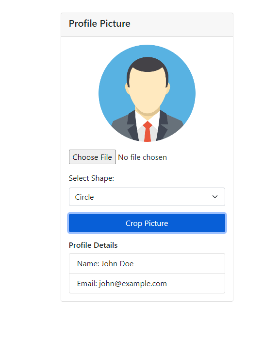

# Profile Page with Image Cropping using Bootstrap and Cropper.js

This project demonstrates a simple profile page where users can upload a profile picture, crop it to a specified shape, and view their profile details.

## Features

- Upload and crop profile picture using Cropper.js.
- Select between square and circular shapes for the profile picture.
- Display basic profile details.

## Technologies Used

- HTML/CSS/JavaScript
- Bootstrap 5
- jQuery
- Cropper.js

## Setup Instructions

1. Clone the repository.
2. Open `index.html` in a web browser.

## How to Use

- Click on the "Choose File" button to upload an image.
- Use the crop feature to select the desired area of the image.
- Select the shape (square or circle) for the cropped image.
- Click "Crop Picture" to finalize the cropping.
- View the cropped image and updated profile details.

## Screenshots

## License

This project is licensed under the MIT License - see the [LICENSE](./LICENSE) file for details.
